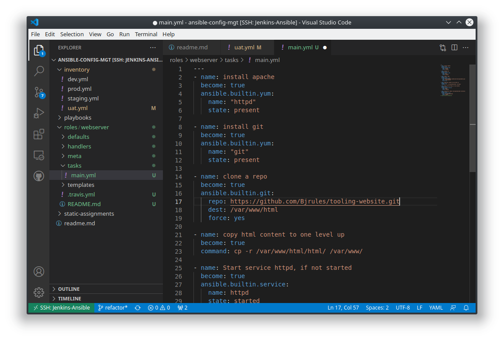

#####  This  particular project intends to Improve upon the project 11 such that our codes are refactored, Also Improve the jenkins build to a directory of our choice in other to make our jenkins cleaner and consume less disk space  witht the help of 'copy artifact plugins' 

#### Banjo Babade's project 12 at Darey.io DevOps Platform

### NB project folder can be found in refactor branch of https://github.com/Bjrules/ansible-config-mgt.git 

#### PROJECT DIAGRAM

0

#### created the folder ansible-config-artifact for the artifacts and set the permission 

##### find copy artifacts under available plugins via plugin manager

#### downloading and installing the copy artifact plugins

#### configuring the artifact to work

#### configurtaions of the plugins

[label](README.md%0D) [label](IMG-SCREENSHOTS/Screenshot_20230210_155954.png%0D) [label](IMG-SCREENSHOTS/Screenshot_20230210_160427.png%0D) 

#### files were copied into the directory after a successful buld and now our Jenkins is cleaner

##### triggered an entry buy updating the read me file 

#### refactored and common-del.yml is now imported into site.yml which is to uninstalled wireshark that was installed  in project 11 on all servers
[label](README.md%0D) [label](IMG-SCREENSHOTS/Screenshot_20230214_120122.png%0D) [label](IMG-SCREENSHOTS/Screenshot_20230214_120058.png%0D) 

#### Create two UAT servers web1-UAT and web2-UAT

### creating roles folder in ansible-config-mgt

#### running ' ansible-galaxy init webserver' and then removing unwanted folders

#### Configuring uat webserver inventory file and setting the path for roles by modifying the file /etc/ansible/ansible.cfg by uncommenting roles_path and filling in the desired details 
[label](README.md%0D) [label](IMG-SCREENSHOTS/Screenshot_20230214_124823.png%0D) 

#### writting the task command inside task/main.yml

#### running playbooks/site.yml on inventory/uat.yml and debuging unreachable errors, ssh-agent errors etc until successful.
[label](IMG-SCREENSHOTS/Screenshot_20230214_224209.png%0D) [label](IMG-SCREENSHOTS/Screenshot_20230214_224222.png%0D) [label](IMG-SCREENSHOTS/Screenshot_20230214_224235.png%0D) [label](IMG-SCREENSHOTS/Screenshot_20230214_224241.png%0D) [label](IMG-SCREENSHOTS/Screenshot_20230214_225346.png%0D) [label](IMG-SCREENSHOTS/Screenshot_20230214_225523.png%0D) [label](IMG-SCREENSHOTS/Screenshot_20230214_225614.png%0D) [label](README.md)

### NB project folder can be found in refactor branch of https://github.com/Bjrules/ansible-config-mgt.git 

## DEVOPS ROCKS